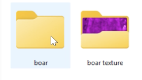

# Comment changer la texture dans GTA ?

**1\. Après avoir installé Open IV, créer un dossier sous le nom “mods”**

 

**2\. Trouvez le dossier où vous souhaitez changer de texture**   
Par exemple, si vous voulez changer la texture des animaux aller vers :  
x64e.rpf \> models \> cdimages \> componentpeds\_a\_c.rpf 

**3\. Créez deux dossiers sur votre PC, fichier 1 pour y placer la texture d’origine et fichier 2 pour la nouvelle**   

**4\. Exportez la texture pour le placer dans le fichier 1\ (en jpg ou en png)** 

**5\. Cliquez sur Edit mode pour dupliquer le fichier, vous le retrouverez directement dans le dossier mods** 

**6\. Remplacer la texture en cliquant sur “Replace” en gardant le même nom que la texture d’origine** 

**7\. Cliquez sur “Save” pour sauvegarder le changement**

**8\. Ouvrez GTA, vous retrouverez le changement dans le jeu**

Vidéo du tutoriel :

